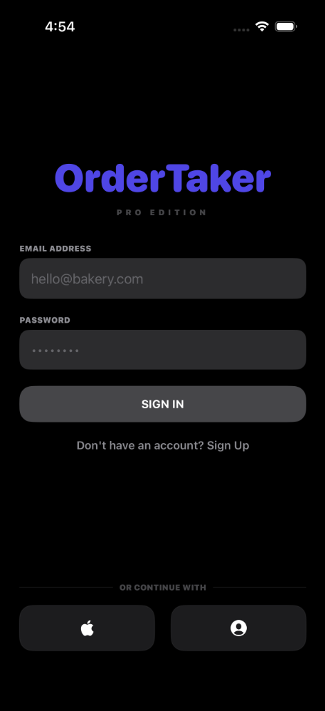
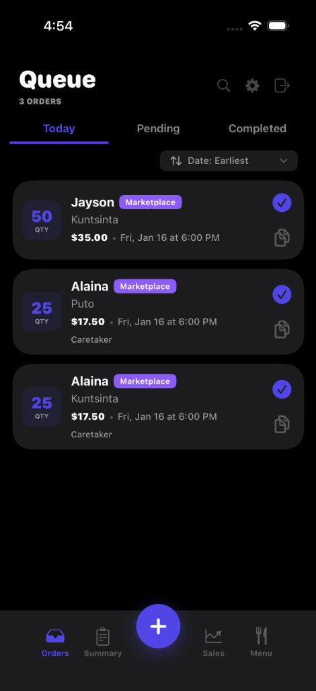
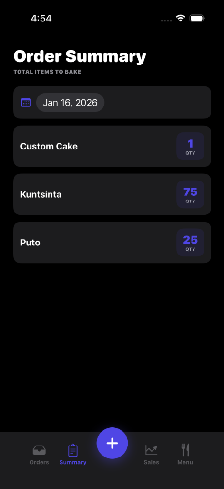
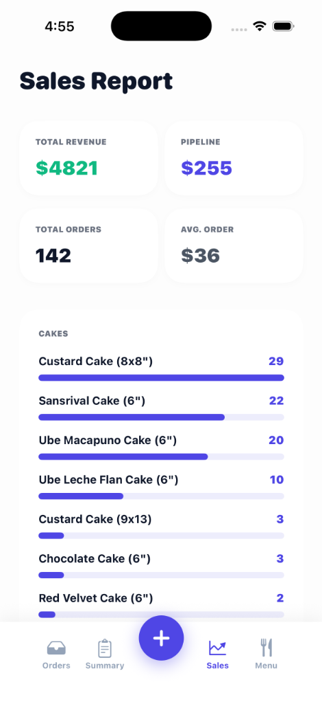
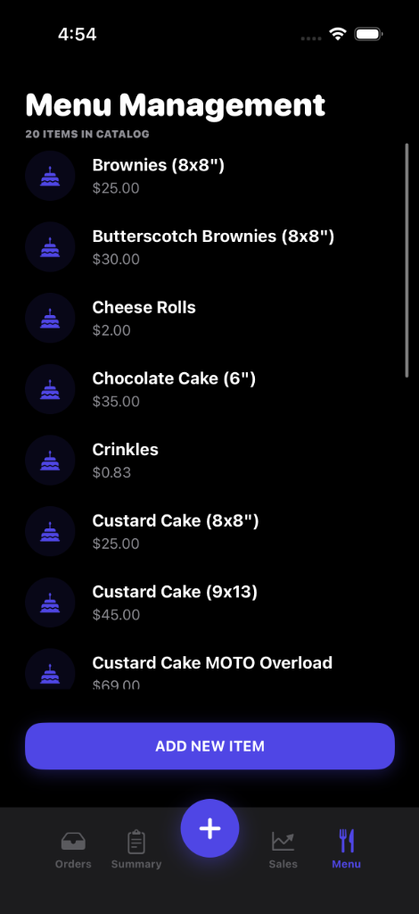
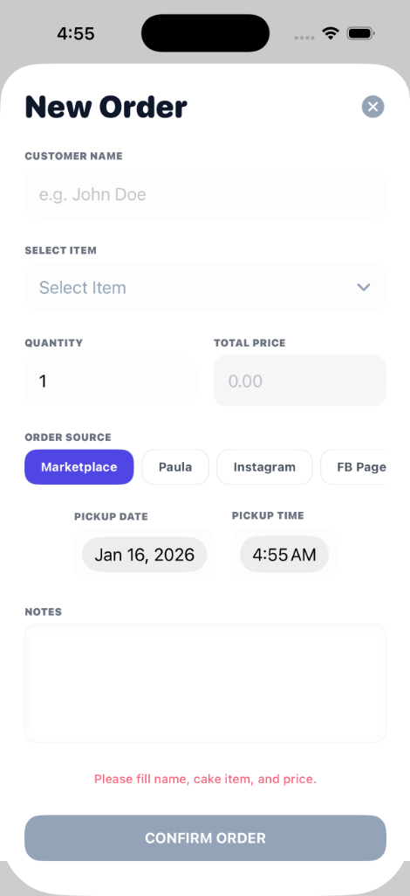
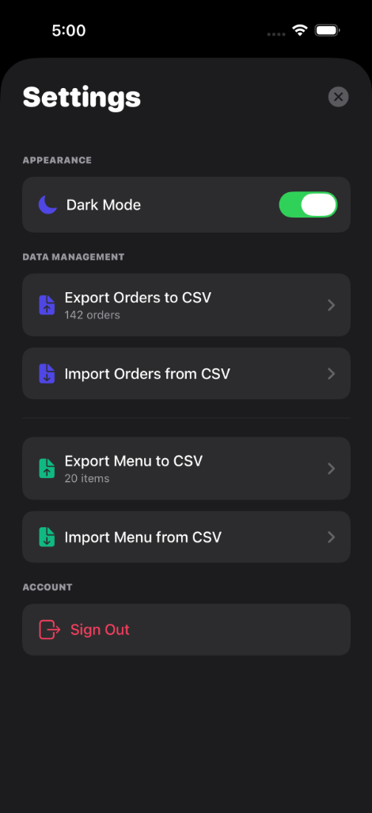

# 📱 OrderTaker iOS

> Professional bakery order management system for iOS

[](https://swift.org)
[](https://developer.apple.com)
[](https://firebase.google.com)

## 🎯 Overview

OrderTaker is a comprehensive iOS application designed for bakery businesses to manage orders, track inventory, and analyze sales. Built with SwiftUI and Firebase, it provides a seamless experience for order processing and business insights.

## ✨ Features

### 📋 Order Management
- Real-time order tracking with status updates (Pending/Completed)
- Quick add order with smart form validation
- Swipe actions for editing and deleting
- Duplicate orders with one tap
- Filter by Today, Pending, or Completed

### 🎂 Menu Management
- Dynamic menu with alphabetically sorted items
- Add, edit, and delete menu items
- Base price tracking
- 20+ default bakery items included

### 📊 Sales Analytics
- Revenue tracking (Completed vs Pipeline)
- Categorized sales reports (Cakes vs Desserts)
- Average order value
- All-time statistics dashboard

### 📝 Production Summary
- Daily production totals by item
- Date picker for historical views
- Real-time quantity aggregation
- **📊 Sales Reports**: Revenue tracking, KPI dashboard, order source breakdown
- **📤 Import/Export**: CSV-based data portability for orders and menu

### ⚙️ Advanced Features
- CSV Import/Export for orders and menu
- Dark mode support
- Settings management
- Firebase Authentication
- Offline-first architecture

## 🆕 Recent Updates (January 2026)

### Dark Mode Support
- ✅ Full adaptive color system using iOS system colors
- ✅ All views now properly support light and dark modes
- ✅ Settings toggle updates immediately without closing sheet
- ✅ 10 view files updated with adaptive backgrounds and text colors

### Sort Filters
- ✅ 4 sorting options: Date (Earliest/Latest), Price (Low/High)
- ✅ Auto-switching based on tab (Completed defaults to Latest)
- ✅ Fixed-width button prevents text overflow
- ✅ Menu UI with checkmarks for active selection

### UI Improvements
- ✅ Summary screen quantity badges match order card style
- ✅ Completed tab shows most recent orders first by default
- ✅ Refined spacing throughout the app (6pt card spacing)
- ✅ Consistent quantity badge design (50x50pt rounded square)

---

## 🚀 Getting Started
=======

### 1. Prerequisites

*   **Mac Setup**: macOS Sonoma or newer.
*   **Xcode**: Version 15.0+ (Available on the Mac App Store).
*   **Git**: Pre-installed on macOS, or install via Homebrew.
*   **Firebase Account**: Required for backend services.

### 2. Clone the Repository

Open your Terminal and run the following commands to download the project code:

```bash
# Clone the repository
git clone https://github.com/mltpascual/OrderTaker-IOS.git

# Navigate to the project directory
cd OrderTaker-IOS
```

### 3. Firebase Configuration (Crucial Step)

The project requires a sensitive configuration file (`GoogleService-Info.plist`) which is **not included in the repository** for security reasons.

1.  Go to the [Firebase Console](https://console.firebase.google.com/).
2.  Open your project (or create a new one).
3.  In "Project Settings", select the iOS app.
4.  Download **`GoogleService-Info.plist`**.
5.  Drag and drop this file into the root `OrderTaker/` folder in Finder.
6.  **Important**: When adding to Xcode later, ensure it is checked for the "OrderTaker" target.

### 4. Open Project & Install Dependencies

This project uses **Swift Package Manager (SPM)**, which is built directly into Xcode. It will automatically download dependencies (Firebase, Google Sign-In) when you open the project.

1.  **Open the Project**:
    Double-click `OrderTaker.xcodeproj` in the project folder.

2.  **Wait for Package Resolution**:
    Look at the bottom-right status bar in Xcode. You will see "Resolving Packages...". Wait for this to finish. 
    *   *If packages fail to resolve, go to `File > Packages > Reset Package Caches`.*

### 5. Build and Run

1.  Select a **Simulator** (e.g., iPhone 15 Pro) from the top device selector.
2.  Press **Cmd + R** (or click the Play button) to build and run.
3.  The simulator should launch and display the Login screen.
    *   *Note: Google Sign-In requires the correct URL Scheme to be configured in `Info.plist` if you created a fresh project.*

## 📱 Screenshots

<p align="center">
  
  
  
  
  
  
  
</p>

## 📚 Documentation

This project includes comprehensive blueprint documentation in the `blueprints/` directory. These files have been **updated to reflect the current Swift iOS architecture** (migrated from the original PWA implementation):

- **[ai-handover.md](blueprints/ai-handover.md)** - AI agent context and handover protocol
- **[design-system.md](blueprints/design-system.md)** - SwiftUI Theme system and UI/UX guidelines
- **[project-overview.md](blueprints/project-overview.md)** - Tech stack and project goals
- **[technical-architecture.md](blueprints/technical-architecture.md)** - Data models and business logic

> [!NOTE]
> All documentation has been updated as of January 2026 to accurately reflect the native iOS implementation using Swift, SwiftUI, and Firebase.

## 🏗️ Architecture

```
OrderTaker/
├── Models/
│   ├── CakeOrder.swift       # Order data model
│   ├── CakeItem.swift        # Menu item model
│   └── UserProfile.swift     # User model
├── Views/
│   ├── DashboardView.swift   # Orders list
│   ├── OrderFormView.swift   # Add/Edit order
│   ├── MenuView.swift        # Menu management
│   ├── ReportsView.swift     # Sales analytics
│   ├── SummaryView.swift     # Production summary
│   └── SettingsView.swift    # Settings & CSV
├── Services/
│   └── StoreService.swift    # Firebase & data management
├── Theme/
│   ├── Theme.swift           # App colors & fonts
│   └── UIComponents.swift    # Reusable components
└── blueprints/               # Design docs (updated)
```

## 🎨 Design System

**Colors:**
- Primary: Indigo (#4F46E5)
- Success: Green
- Danger: Red
- Background: Light gray

**Typography:**
- Header: SF Pro, 32pt, Bold
- Body: SF Pro, 16pt, Medium
- Labels: SF Pro, 11pt, Uppercase

## 📦 Data Models

### CakeOrder
```swift
{
  itemName: String
  customerName: String
  quantity: Int
  total: Double
  notes: String
  source: String  // Marketplace, Paula, FB Page
  pickupDate: String  // yyyy-MM-dd
  pickupTime: String  // HH:mm
  status: String  // pending, completed
}
```

### CakeItem
```swift
{
  name: String
  basePrice: Double
}
```

## 🔧 Configuration

### Firebase Collections

```
users/
  {userId}/
    ├── profile (document)
    ├── orders/ (collection)
    └── menu/ (collection)
```

### CSV Import Format

**Orders:**
```
Date	Time	Order	Quantity	Cost	Name	Status	Notes	Source
Friday, January 16, 2026	12:00 PM	Leche Flan	1	10	Customer	completed		Marketplace
```

**Menu:**
```
Item Name	Base Price
Custard Cake (8x8")	25.00
```

## 🚢 Deployment

### TestFlight
1. Archive the app in Xcode
2. Upload to App Store Connect
3. Add testers
4. Distribute

### App Store
1. Prepare app metadata
2. Add screenshots
3. Submit for review
4. Wait for approval

## 🤝 Contributing

Contributions are welcome! Please follow these steps:

1. Fork the repository
2. Create a feature branch (`git checkout -b feature/AmazingFeature`)
3. Commit changes (`git commit -m 'Add some AmazingFeature'`)
4. Push to branch (`git push origin feature/AmazingFeature`)
5. Open a Pull Request

## 📄 License

This project is private and proprietary.

## 👥 Authors

- **Miguel Pascual** - *Initial work* - [@mltpascual](https://github.com/mltpascual)

## 🙏 Acknowledgments

- Firebase for backend services
- Apple Human Interface Guidelines
- SF Symbols for iconography

---

**Built with ❤️ for bakeries**
